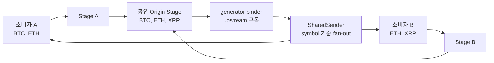

# trading-core

코인·주식 WebSocket API를 위한 **타입 안전 비동기 스트리밍 코어**입니다.

`trading-core`는 거래소나 증권사에 종속된 WebSocket 클라이언트가 아닙니다. 대신 실시간
시세·체결·호가 스트림을 연결할 때 반복해서 필요한 요청 모델링, 구독 공유, 심볼별
라우팅, 의존 스트림 연결, 비동기 태스크와 자원 수명 주기를 작은 범용 런타임으로
제공합니다. 거래소별 인증, 구독 메시지, 응답 파싱만 어댑터로 구현하면 나머지 흐름은
같은 구조로 운용할 수 있습니다.

> 현재 버전은 `0.1.0`입니다. 프로덕션 적용 전에는 아래의
> [현재 범위와 제한 사항](#현재-범위와-제한-사항)을 반드시 확인하세요.

## 왜 trading-core인가

실시간 마켓 데이터 시스템에서는 여러 전략과 지표가 같은 종목을 동시에 구독합니다.
소비자마다 WebSocket 연결을 새로 만들면 연결 수와 트래픽이 불필요하게 늘어나고,
구독 추가·해제와 연결 종료도 각자 처리해야 합니다.

`trading-core`는 이 문제를 다음 원칙으로 다룹니다.

- **타입이 있는 경계**: 요청은 `RequestModel`, 출력은 `DataModel`로 정의하며 Pydantic
  검증과 직렬화를 그대로 사용합니다.
- **동일 요청 공유**: 내용이 같은 요청은 하나의 원천 스테이지와 컨텍스트를 공유합니다.
- **구독 합집합 관리**: 여러 소비자가 요구한 심볼의 합집합만 upstream binder에
  전달합니다.
- **심볼별 fan-out**: 원천 데이터는 해당 `symbol`을 구독한 소비자에게만 라우팅됩니다.
- **명시적인 수명 주기**: 구독 구성이 달라질 때와 마지막 소비자가 떠날 때를 구분하여
  네트워크 자원을 정리할 수 있습니다.
- **스트림 의존성**: 파생 요청이 다른 원천 요청을 `require()`하고, 원천 데이터를 받아
  변환하는 파이프라인을 만들 수 있습니다.

## 요구 사항과 설치

- Python 3.14 이상
- 런타임 의존성: [Pydantic 2](https://docs.pydantic.dev/)
- 권장 패키지 관리자: [uv](https://docs.astral.sh/uv/)

저장소를 개발 환경으로 준비하려면 다음 명령을 실행합니다.

```bash
git clone https://github.com/bynaki/trading-core.git
cd trading-core
uv sync
```

다른 uv 프로젝트에서 직접 의존하려면 로컬 경로나 Git 저장소를 사용할 수 있습니다.

```bash
uv add /path/to/trading-core
uv add "https://github.com/bynaki/trading-core.git"
```

## 빠른 시작

아래 예제는 가상의 시세 소스를 등록하고 `BTC`와 `ETH` 스트림을 소비합니다. 실제
WebSocket 연동에서는 binder의 반복문을 클라이언트의 메시지 수신 루프로 교체하면 됩니다.

```python
from asyncio import run, sleep

from trading_core import DataModel, Domain, Receiver, RequestModel, generator


class PriceRequest(RequestModel):
    venue: str


class Price(DataModel):
    value: float


class PriceFeed:
    def __init__(self, request: PriceRequest) -> None:
        self.request = request
        self.sequence = 0


@generator(PriceRequest)
def price_feed(request: PriceRequest) -> PriceFeed:
    # 같은 request content_id가 살아 있는 동안 한 번만 생성되는 공유 컨텍스트
    return PriceFeed(request)


@price_feed.bind
async def _(
    feed: PriceFeed,
    symbols: set[str],
    receiver: Receiver | None,
):
    # 실제 어댑터라면 여기서 symbols를 WebSocket에 구독합니다.
    try:
        while True:
            for symbol in sorted(symbols):
                feed.sequence += 1
                yield Price(symbol=symbol, value=float(feed.sequence))
            await sleep(1)
    finally:
        # 심볼 합집합이 바뀌거나 마지막 구독이 해제될 때 현재 binder가 닫힙니다.
        pass


@price_feed.close
async def _(feed: PriceFeed) -> None:
    # 마지막 소비자가 떠났을 때 공유 WebSocket 연결을 종료합니다.
    pass


async def main() -> None:
    domain = Domain()
    await domain.start()
    try:
        request = PriceRequest(venue="demo")
        async with domain.request(request, {"BTC", "ETH"}) as stream:
            async for price in stream:
                print(price.model_dump_json())
                if price.value >= 4:
                    break
    finally:
        await domain.stop()


run(main())
```

중요한 규칙은 두 가지입니다.

1. `@generator(RequestType)`가 실행되어 레지스트리에 등록된 뒤 해당 요청을 사용해야 합니다.
2. `Domain.start()` 후 요청을 열고, 모든 요청 컨텍스트를 닫은 다음 `Domain.stop()`을
   호출해야 합니다.

## 동작 구조



같은 내용의 `RequestModel`은 같은 `content_id`를 가지므로 하나의 origin stage를
공유합니다. 위 예에서 binder가 받는 심볼은 `{BTC, ETH, XRP}`이고, `ETH` 데이터는 두
소비자 모두에게, `BTC`와 `XRP` 데이터는 각각 요청한 소비자에게만 전달됩니다.

심볼 합집합이 바뀌면 현재 binder를 취소·종료하고 같은 컨텍스트로 새 binder를
시작합니다. 따라서 binder의 `finally`는 **구독 업데이트 단위 정리**, `@generator.close`는
**공유 스테이지 전체 정리**에 적합합니다.

## 핵심 구성 요소

### `RequestModel`

데이터 소스와 구독 옵션을 표현하는 Pydantic 모델입니다. 거래소, 채널, 마켓 타입,
캔들 주기처럼 “어떤 스트림인가”를 결정하는 값을 필드로 둡니다.

```python
from typing import Literal

from trading_core import RequestModel


class CandleRequest(RequestModel):
    venue: Literal["binance", "coinbase"]
    interval: Literal["1m", "5m", "1h"]
```

요청 필드 값은 `content_id`에 포함됩니다. 내용이 같은 요청은 원천을 공유하고, 값이
다르면 별도 원천으로 관리됩니다.

### `DataModel`

스트림을 흐르는 Pydantic 모델입니다. 모든 `DataModel`에는 라우팅 키인 `symbol: str`이
기본 필드로 존재합니다.

```python
from decimal import Decimal

from trading_core import DataModel


class Trade(DataModel):
    price: Decimal
    quantity: Decimal
    trade_id: str
```

binder가 생성하는 데이터의 `symbol`은 구독에 사용한 문자열과 일치해야 합니다.
`SharedSender`는 이 값을 기준으로 소비자를 선택합니다.

### `generator`

`@generator(RequestType)`는 요청 타입과 데이터 소스를 연결합니다.

- 데코레이트한 함수: 공유 스테이지 컨텍스트를 생성합니다.
- `@source.bind`: 현재 심볼 합집합으로 비동기 데이터를 생성합니다.
- `@source.close`: 마지막 구독자가 사라질 때 컨텍스트 자원을 정리합니다.

```python
@generator(TradeRequest)
def trades(request: TradeRequest) -> TradeSocket:
    return TradeSocket(request)


@trades.bind
async def _(socket: TradeSocket, symbols: set[str], receiver: Receiver | None):
    await socket.subscribe(symbols)
    try:
        async for message in socket.messages():
            yield Trade(
                symbol=message.symbol,
                price=message.price,
                quantity=message.quantity,
                trade_id=message.trade_id,
            )
    finally:
        await socket.unsubscribe(symbols)


@trades.close
async def _(socket: TradeSocket) -> None:
    await socket.close()
```

위 코드는 어댑터의 역할을 보여주는 구조 예시입니다. `TradeSocket`은 사용하는 거래소나
증권사 SDK에 맞게 구현해야 합니다.

### `Domain.request()` — 고수준 스트림 API

출력 큐와 스테이지를 내부에서 만들고 비동기 반복자를 반환합니다. 일반적인 소비자는 이
API를 사용하면 됩니다.

```python
request = CandleRequest(venue="binance", interval="1m")

async with domain.request(request, {"BTCUSDT", "ETHUSDT"}) as stream:
    async for candle in stream:
        print(candle)
        if should_stop(candle):
            break
```

`async with`는 조기 `break`나 예외가 발생해도 해당 소비자의 구독을 제거합니다.

### `Domain.stage()` — 저수준 동적 구독 API

호출자가 비동기 `Sender`를 제공하고 실행 중 심볼 집합을 교체할 수 있습니다.

```python
class StrategyInbox:
    async def __call__(self, data: DataModel) -> None:
        await handle(data)


async with domain.stage(request, StrategyInbox()) as stage:
    await stage.update({"BTCUSDT"})
    await stage.update({"BTCUSDT", "ETHUSDT"})
    await stage.update({"ETHUSDT"})
```

`update()`는 기존 집합에 추가하는 함수가 아니라 **해당 Stage가 원하는 전체 심볼 집합을
교체**하는 함수입니다. 빈 집합을 전달하거나 컨텍스트를 벗어나면 그 Stage의 구독이
제거됩니다.

## 파생 스트림과 의존 요청

`require()`를 사용하면 한 요청의 binder가 다른 요청의 데이터를 입력으로
받을 수 있습니다. 예를 들어 하나의 원천 체결 스트림으로 체결가와 거래량 지표를 각각
만들 수 있습니다.

```python
class RawTradeRequest(RequestModel):
    venue: str


class NotionalRequest(RequestModel):
    venue: str


@require(NotionalRequest)
def notional_requirement(request: NotionalRequest) -> RequestModel:
    return RawTradeRequest(venue=request.venue)


@notional_requirement
def notional(request: NotionalRequest) -> NotionalContext:
    return NotionalContext(request)


@notional.bind
async def _(
    context: NotionalContext,
    symbols: set[str],
    receiver: Receiver,
):
    while raw := await receiver():
        trade = cast_model(raw, Trade)
        yield Notional(
            symbol=trade.symbol,
            value=trade.price * trade.quantity,
        )
```

`Domain`은 필요한 원천 스테이지를 생성하거나 기존 스테이지를 재사용하고,
`TransmitQueue`를 통해 원천 출력을 파생 binder의 `receiver`에 연결합니다. 의존 원천도
동일하게 요청 내용과 전체 심볼 합집합을 기준으로 공유됩니다.

현재 `require()`는 요청 타입당 하나의 직접 의존 요청을 선언합니다. 의존 요청이 다시
다른 요청을 요구하는 연쇄 구조는 만들 수 있지만, 순환 의존은 사용하면 안 됩니다.

## 모델 식별자와 직렬화

모든 모델은 직렬화 결과에 `tr_annotation`을 포함합니다.

| 식별 정보 | 기준 | 주요 용도 |
| --- | --- | --- |
| instance `id` | 생성 출처와 클래스별 순번 | 개별 모델 인스턴스 추적 |
| `model_id` | 모듈명, 클래스명, 필드 이름 구조 | 타입 기반 디스패치와 검증 |
| `content_id` | 모델 타입과 JSON 직렬화 내용 | 동일 요청 공유, 내용 기반 식별 |

주요 헬퍼는 다음과 같습니다.

- `get_model_id(model)`: 클래스 구조 기반 ID를 반환합니다.
- `model.get_tr_content_id()`: 내용 기반 ID를 반환합니다.
- `validate_dump(data)`: JSON 문자열·bytes·mapping의 annotation 구조를 검증합니다.
- `validate_model(data, ModelType)`: 직렬화된 데이터를 지정 모델로 복원합니다.
- `cast_model(data, ModelType)`: `model_id`가 같은지 확인하고 복사 없이 타입을
  좁힙니다.
- `set_origin_name(name)`: 프로세스의 모델 생성 출처 이름을 최초 한 번 지정합니다.

`cast_model()`은 Python 상속 관계만 보지 않고 정확한 `model_id` 일치를 요구합니다.
따라서 잘못된 데이터 타입이 파생 스트림에 섞이는 문제를 조기에 발견할 수 있습니다.

## WebSocket 어댑터 설계 가이드

거래소·증권사 API를 연결할 때 각 책임을 다음처럼 나누는 구성이 자연스럽습니다.

| 계층 | 권장 책임 |
| --- | --- |
| `RequestModel` | 거래소, 채널, 마켓 종류, 주기 등 연결/스트림 식별 옵션 |
| generator context | 클라이언트, 인증 상태, 연결 객체, 재연결에 필요한 공유 상태 |
| binder | 현재 심볼 집합 구독, 메시지 수신·파싱, `DataModel` 생성 |
| binder `finally` | 현재 심볼 집합 구독 해제, 업데이트 단위 태스크 정리 |
| generator `close` | WebSocket과 세션 등 컨텍스트 전체 자원 종료 |
| `Domain` | 공유 원천, 소비자별 Stage, 심볼 합집합, 태스크 수명 주기 |

다음 사항도 어댑터에서 명시적으로 결정해야 합니다.

- 거래소 심볼과 내부 표준 심볼의 변환 규칙
- heartbeat/ping-pong 및 연결 끊김 감지
- 지수 백오프, 재인증, 재구독을 포함한 재연결 정책
- sequence number 누락, snapshot/delta 정합성 검증
- rate limit과 최대 구독 수에 따른 연결 분할
- 중복 메시지와 out-of-order 이벤트 처리
- 느린 소비자에 대한 버퍼 및 backpressure 정책

## 예제

`examples/`는 단순 API 데모가 아니라 공유와 정리 동작을 검증하는 실행 가능한 시나리오로
구성되어 있습니다.

| 예제 | 다루는 내용 | 상세 문서 |
| --- | --- | --- |
| `ex01` | `Domain.request()` 소비, 시작값부터 발행, 조기 종료와 두 단계 정리 | [examples/ex01/README.md](examples/ex01/README.md) |
| `ex02` | `require()`, 공통 원천 공유, 파생 스트림, 심볼별 라우팅 | [examples/ex02/README.md](examples/ex02/README.md) |
| `ex03` | `Domain.stage()`, 동적 심볼 교체, 동일 요청의 원천과 상태 공유 | [examples/ex03/README.md](examples/ex03/README.md) |

프로젝트 루트에서 개별 예제 또는 전체 예제를 실행할 수 있습니다.

```bash
uv run python examples/ex01/run_ex.py
uv run python examples/ex02/run_ex.py
uv run python examples/ex03/run_ex.py
uv run python examples/main.py
```

예제 binder는 수명 주기를 관찰하기 위해 일정 간격으로 계속 데이터를 생성합니다. 전체
예제를 실행하면 완료까지 시간이 걸리며, 로그에서 binder 재시작과 close 콜백을 확인할
수 있습니다.

## 현재 범위와 제한 사항

`trading-core`는 지금 **스트리밍 오케스트레이션의 핵심 골격**에 집중합니다.

포함하는 범위:

- Pydantic 기반 요청·데이터 모델과 annotation
- generator 등록 및 타입 기반 조회
- 내용이 같은 요청의 in-memory 원천 공유
- 소비자별 심볼 라우팅과 전체 구독 합집합 관리
- 단일 의존 스트림 연결
- 비동기 태스크 취소와 binder/컨텍스트 정리 지점
- `task`, `Sequence`, `processor`의 기초 구성 요소

아직 프레임워크가 직접 제공하지 않는 범위:

- 특정 거래소·증권사의 WebSocket/REST 클라이언트
- 인증, heartbeat, 자동 재연결, 재구독, rate limit 정책
- 주문 실행, 포트폴리오, 리스크, 저장소, 전략/지표 구현
- 프로세스 간 또는 서버 간 원천 공유
- bounded queue 및 backpressure 정책
- binder 예외를 소비자 스트림으로 전달하는 완결된 오류 채널

또한 `Domain`의 현재 실행 경로는 `generator` 기반 스테이지에 맞춰져 있습니다.
`task`와 `Sequence`는 직접 조합하여 호출할 수 있고 `processor` 등록 API도 존재하지만,
이들은 아직 `Domain.request()`의 end-to-end 처리 경로로 통합되어 있지 않습니다.

## 개발

모든 명령은 프로젝트의 uv 환경에서 실행합니다. 코드 변경 후 아래 네 검사를 모두
통과해야 합니다.

```bash
uv run ruff check .
uv run ruff format --check .
uv run pyright
uv run pytest
```

포맷을 적용하려면 다음 명령을 사용합니다.

```bash
uv run ruff format .
```

테스트는 다음 동작을 포함해 검증합니다.

- 모델 annotation, `model_id`, `content_id`, 직렬화 복원과 안전한 cast
- 심볼 기반 fan-out과 `TransmitQueue` 전달
- 동일 요청의 원천 공유 및 합집합이 바뀔 때만 binder 재시작
- 빈 구독의 스테이지 제거와 close 콜백
- 의존 원천의 생성·공유·정리
- 실행 전/실행 중 태스크 취소와 이름 점유 해제
- 세 예제의 실제 출력, 상태 공유 및 자원 정리 시나리오

## 프로젝트 구조

```text
src/trading_core/
├── __init__.py       # 공개 API
├── model.py          # RequestModel, DataModel, 식별자, 검증, Sequence
├── definer.py        # generator, task, processor 정의 및 레지스트리
├── domain.py         # Domain, Stage, 라우팅, 의존 스트림, 수명 주기
├── helper.py         # digest와 비동기 TaskManager
├── exceptions.py     # 프레임워크 예외
└── py.typed          # 타입 정보 제공 표시

examples/             # 실행 가능한 구독·공유·의존성 예제
tests/                # 프레임워크와 예제의 동작 명세
```

## 라이선스

[MIT License](LICENSE)
